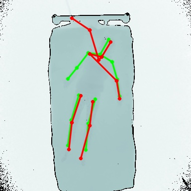

# predsVsGTs-depthPng-V1


### Context:
The original experiment used crop regions defined based on the GT bounding box, this cannot be used during inference on in-the-wild data, so another approach is required  

---
### Experiment Parameters:  
- Images for all subjects cropped to the same window according to:
	```python
    def cropDepthPngFromSimLab(img):
        #! crop image to fixed square in centre
        origHeight, origWidth = img.shape[:2]
        shiftPercentageYX = [0.01, 0]
        newSize = int(origHeight * 0.75)
        newMinY = (origHeight - newSize) // 2 + int(origHeight * shiftPercentageYX[0])
        newMinX = (origWidth - newSize) // 2 + int(origWidth * shiftPercentageYX[1])
        img = img[newMinY:newMinY+newSize, newMinX:newMinX+newSize]
        return img, newMinY, newMinX
	```
	- side length 75% of the original
	- region is 1% lower than the true centre of the image
	- region is in the centre horizontally

---
### Experiment Results/Notes:
- Often the poor cropping (including the head of the bed) causes wrist keypoints to be incorrectly placed on the bedhead (see s00001_uncover_p05)
	- **To improve this, specific crops for each subject can be hardcoded to allow closer cropping since the bed position in the frame does not change significantly for all images for each subject**
	- 