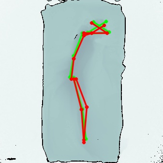
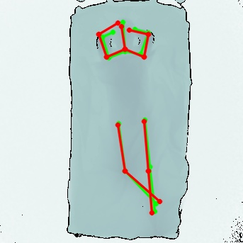
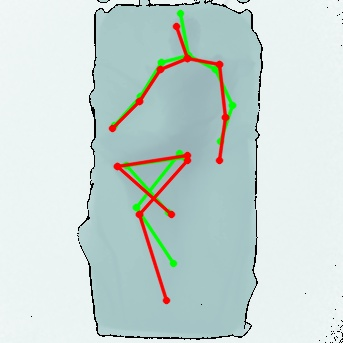
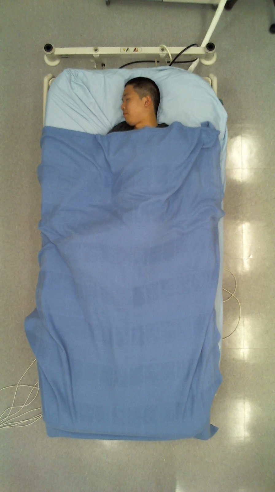
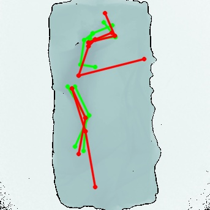
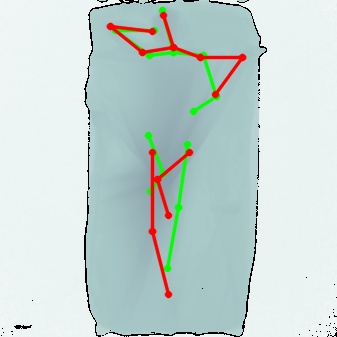

# predsVsGTs-depthPng-V2.0  

### Context:
The original experiment used crop regions defined based on the GT bounding box, this cannot be used during inference on in-the-wild data, so another approach is required  

**Previous Experiment:**  [***predsVsGTs-depthPng-V1***]  
Images were cropped to a standard 75% of image height, which resulted in some wrist keypoints being predicted on the bed head

---
### Experiment Parameters:  
- Aim to improve performance by accurately cropping all inputs to the bed bounds
	- ***Note the same cropping script as V1, but with params specific to each subject***
- Images cropped to set windows specific to each subject according to:
	```python
    def individualSubjectCrop(img, subj):
        '''crop separately for each subject to only bed (exclude bedhead)'''
        percentagesPerSubj = [ #[heightScale, shiftX, shiftY]
            [0.67, 0., 0.07], # 00001
            [0.66, 0.03, 0.045], # 00002
            [0.68, 0.04, 0.035], # 00003 #! note subj 3 has head above top of bed, not present for other subjects
            [0.67, 0.04, 0.045], # 00004
            [0.67, 0.04, 0.02], # 00005
            [0.67, 0.04, 0.02], # 00006
            [0.67, 0.04, 0.045], # 00007
        ]
        heightScale, shiftX, shiftY = percentagesPerSubj[subj-1]
        origHeight, origWidth = img.shape[:2]
        shiftPercentageYX = [shiftY, shiftX]
        newSize = int(origHeight * heightScale)
        newMinY = (origHeight - newSize) // 2 + int(origHeight * shiftPercentageYX[0])
        newMinX = (origWidth - newSize) // 2 + int(origWidth * shiftPercentageYX[1])
        cropped = img[newMinY:newMinY+newSize, newMinX:newMinX+newSize]
        return cropped, newMinY, newMinX
	```
	- side length ~67% of the original
	- region is shifted to contain the bed in the centre

---
### Experiment Results/Notes:
- Significantly improved performance compared to V1
	-    
	-    
	- Bedhead is cropped out of the image, preventing keypoints plotted on it
- **Model was trained with inputs cropped to 10% margin either side of GT bounding box**
	- This likely introduces bias to plotting keypoints near the edge of the input
	- ***Due to the bias, it is best to pre-crop to the smallest region known to contain all keypoints***  
---
### Potential Improvements:
- The model still exhibits bias towards plotting keypoints near (~10% inset from) the top and bottom
	-   
	- This is most likely due to the bias present in image cropping during training (despite augmentation during training)
	- scale of crops are defined by:
		```python
		scale_factor = 0.25
		scale = np.clip(np.random.randn(), -1.0, 1.0) * scale_factor + 1.0
		# (scale is then used before image cropping)
		```
		- ***The 0.25 scaling and normal distribution may not produce enough scale augmentation to avoid biasing the model, plus there is no translation  so the cropped regions are always centered on the GT bounding box***
		- Note that SLP pretrained model reported accuracies are based on tests conducted with this same cropping scheme

<br/>  

- Avoiding this bias would require a different cropping scheme during training such as:  
	- fixed margin from the edges of the bed (could be subject specific as in this experiment)
		- note this would similarly make inference reliant on accurate (though unbiased) cropping during inference
	- similar with more augmentation, including translation
		- uniform distribution of scale factor may also help  


	